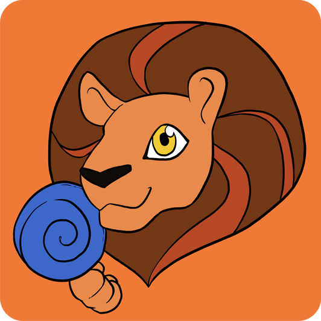

<h1 align="center">Oskar Mróz</h1>
<h2 align="center">Software Developer from Ireland</h2>

<h2>CURRENTLY WORKING ON</h2>

<table border="0">
   <tr>
      <td width="130"></td>
      <td>
         <h3>Clove Software</h3>
         
 I am working on a startup developing and selling productivity software. Some of our current products in development include <a href="https://trackl.ie">Trackl.ie</a>, <a href="https://taskl.ie">Taskl.ie</a>, and <a href="https://ticketl.ie">Ticketl.ie</a>.

         
Website: <a href="https://clove.ie">Clove.ie</a>

          
      </td>
   </tr>
</table>
<table border="0">
   <tr>
      <td width="130"></td>
      <td>
         <h3>Lón don Leon</h3>
         
 Currently employed by Abair, a research laboratory in Trinity College, Dublin. I am developing a React Native app teaching aspects of Irish phonology to pre-literate children.

         
Website: <a href="https://abair.ie">Abair.ie</a>

          
      </td>
   </tr>
</table>
<table border="0">
   <tr>
      <td width="130"></td>
      <td>
         <h3>LunaTech.pl</h3>
         
 I’m a part of a society is Poland that builds model rocket ships. My roles include design and software development. I am currently maintaining the official website.

         
Website: <a href="https://lunatech.pl">LunaTech.pl</a>

          
      </td>
   </tr>
</table>

<h2>CURRENTLY LEARNING</h2>

<ul>
   <li>Material UI</li>
   <li>Sentry</li>
   <li>Tailwind</li>
</ul>

<h2>SOCIALS / CONTACT</h2>

<ul>
   <li>Email: <a href="mailto:oskar@clove.ie">oskar@clove.ie</a></li>
   <li>Website: <a href="https://oskarmroz.com">oskarmroz.com</a></li>
   <li>LinkedIn: <a href="https://linkedin.com/in/o-mroz/">linkedin.com/in/o-mroz/</a></li>
</ul>

<h2>RECENT INTERESTS</h2>

<ul>
   <li>UI & UX Design</li>
   <li>Web Development</li>
   <li>Productivity Systems</li>
   <li>Artificial Intelligence</li>
   <li>Sales & Marketing</li>
</ul>

<h2>MY STACK</h2>

<ul>
<table border="0">
   <tr>
      <td>Area</td>
      <td>Specifics</td>
   </tr>
</table>
</ul>

<h2>PAST YEAR ACTIVITY</h2>

