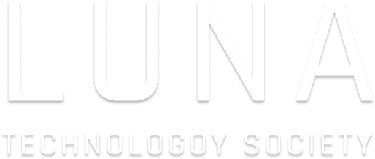

<h2>ABOUT ME</h2>

I'm a Software Developer from Ireland. I've been tinkering with code since I was 16. I'm a natural problem-solver, so programming was like love at first sight for me. I consider it not only a practical tool but also a form of art. One thing that really grinds my gears is when people underestimate the importance of good UI. It's the face of your software and what ultimately sells it to the end user. Aside from programming, I also have an interest in photography and blogging. If you're curious, feel free to check out my latest work on my website www.oskarmroz.com

<h2>CURRENTLY WORKING ON</h2>

<table border="0">
   <tr>
      <td width="130"></td>
      <td>
         <h3>Clove Software</h3>
         
 I am working on a startup developing and selling productivity software. Some of our current products in development include <a href="https://trackl.ie">Trackl.ie</a>, <a href="https://taskl.ie">Taskl.ie</a>, and <a href="https://ticketl.ie">Ticketl.ie</a>.

         
Website: <a href="https://clove.ie">Clove.ie</a>

          
      </td>
   </tr>
</table>
<table border="0">
   <tr>
      <td width="130"></td>
      <td>
         <h3>Lón don Leon</h3>
         
 Currently working for Abair, a research laboratory in Trinity College, Dublin. I am developing a <b>React Native</b> app teaching aspects of Irish phonology to pre-literate children.

         
Abair website: <a href="https://abair.ie">Abair.ie</a>

          
      </td>
   </tr>
</table>
<table border="0">
   <tr>
      <td width="130"></td>
      <td>
         <h3>LunaTech.pl</h3>
         
 I’m a part of a society is Poland that builds model rocket ships. My roles include design and software development. I am currently maintaining the <a href="https://lunatech.pl">official website</a>.

         
Website: <a href="https://lunatech.pl">LunaTech.pl</a>

          
      </td>
   </tr>
</table>

<h2>CURRENTLY LEARNING</h2>

<ul>
   <li>Material UI</li>
   <li>Sentry</li>
   <li>Tailwind</li>
</ul>

<h2>SOCIALS / CONTACT</h2>

<ul>
   <li>Email: <a href="mailto:oskar@clove.ie">oskar@clove.ie</a></li>
   <li>Website: <a href="https://oskarmroz.com">oskarmroz.com</a></li>
   <li>LinkedIn: <a href="https://linkedin.com/in/o-mroz/">in/o-mroz/</a></li>
</ul>

<h2>RECENT INTERESTS</h2>

<ul>
   <li>UI & UX Design</li>
   <li>Web Development</li>
   <li>Productivity Systems</li>
   <li>Artificial Intelligence</li>
   <li>Sales & Marketing</li>
</ul>

<h2>MY STACK</h2>
   
<table border="0">
   <tr>
      <th>Area</th>
      <th>Technologies</th>
   </tr>
   <tr>
      <td>React</td>
      <td>Vite • Gatsby • Webpack • React Native</td>
   </tr>
   <tr>
      <td>Other Front-end</td>
      <td>jQuery • Angular</td>
   </tr>
   <tr>
      <td>Styling</td>
      <td>HTML/CSS (deep knowledge) • SCSS • styled-components • Tailwind • Material UI • Bootstrap</td>
   </tr>
   <tr>
      <td>Databases & Hosting</td>
      <td>Supabase • MySQL • PostgreSQL • Firebase • MongoDB • Firebase</td>
   </tr>
   <tr>
      <td>Backend</td>
      <td>Express, Fastify (JS) • Flask (Python)</td>
   </tr>
   <tr>
      <td>Other</td>
      <td>C • ARM Assembly • VHDL • R • Excel • Arduino • Java • Processing.org</td>
   </tr>
</table>

<h2>PAST YEAR ACTIVITY</h2>

